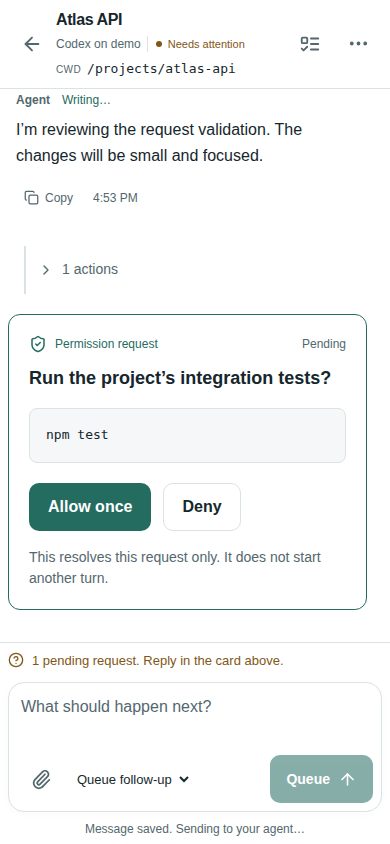

# Relay — conversational remote over Herdr

A self-hosted React PWA and Fastify gateway for persistent coding agents. Herdr owns processes, panes, workspaces, and lifecycle; Relay stores structured conversations, exact native interactions, and queued work. Original terminal sessions remain usable.

**Phase 1 implementation with mock-backed validation.** Existing Claude/Codex CLI sessions are discovered automatically and accept chat messages and durable queued follow-ups through Herdr. The inbox groups by agent and shows session titles and full CWDs. Claude's documented PermissionRequest hook resolves actual permission decisions. A separate sole-writer Codex bridge, launched under Herdr, supports native turns, questions, approvals, steering, and durable queued work. It never attaches a second writer to an existing CLI thread. Live Fred CLI chat and serial queue dispatch have been verified. Key-free tailnet HTTP/WebSocket access is implemented; outside the tailnet, pairing remains required. Full native CLI question parity and physical Android/iOS verification remain outstanding. See the [capability matrix](docs/CAPABILITIES.md).

## Run the credential-free demo

Requires Node 22.20+ and npm.

```sh
npm ci
npm run dev
```

Open http://localhost:4080. Enter the pairing key from `.data/demo/pairing-key` locally. Send “review the API, ask a question” or “make a change requiring approval”, then queue more work. Disconnect/reconnect the browser or restart the gateway while the separate mock harness remains running.

```sh
npm run check
npx playwright install chromium
npm run test:e2e
python3 scripts/verify-design-skills.py
npm run package
```

`npm run dev` builds missing assets; after UI edits run `npm run build`. It is a persistent demo runner, not a hot-reloading development server. Packaging produces `artifacts/relay-0.1.0.tar.gz`, including built browser assets and migration files. Install with `npm ci --omit=dev`; Node's SQLite API is currently experimental.

## What is included

- Live session discovery, native transcript imports, ordered durable replay, reconnects, and process replacement checks.
- Exact interaction responses, validation, expiry, duplicate submission protection, and fail-closed uncertain delivery.
- Per-session SQLite queues with edit, reorder, cancel, pause, restart recovery, serial dispatch and task idempotency.
- Device pairing/revocation, short-lived cookies, read/control grants, authorization, audit records, redaction and private local sockets.
- Mobile inbox, virtualized chat, tool/diff cards, interaction cards, queue, host/device settings, light/dark themes, installable PWA and foreground browser notifications.

[Ubuntu/Fred installation](docs/DEPLOYMENT.md) · [Architecture and protocol](docs/ARCHITECTURE.md) · [Security](docs/SECURITY.md) · [Integration validation](docs/VALIDATION.md) · [Research and licenses](docs/RESEARCH.md) · [UI design workflow](docs/UI_DESIGN.md)



Monorepo: `apps/web`, `apps/gateway`, `packages/{protocol,herdr,adapters,interaction-broker,task-queue,client-sdk,ui,storage,testing}`. No terminal emulator, terminal scraping, private Claude Remote Control API, external broker, or duplicated Herdr supervision.

## Mobile chat and attachments

The mobile-first composer supports files, photos/camera selection, upload progress, retries, removable previews and draft recovery. Sent images can be inspected and downloaded; messages can be copied. Tool activity is collapsed into readable groups. Set `hosts[].localFiles: true` for Fred or another host sharing the gateway filesystem. [Attachment setup](docs/ATTACHMENTS.md), [UI audit](docs/UI_AUDIT.md), and [live validation evidence](docs/VALIDATION.md) distinguish working features from outstanding native interaction gaps.
