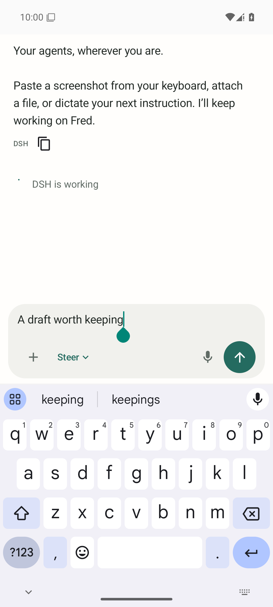

# Relay for Android

A native Kotlin / Jetpack Compose client of the existing Relay gateway. This is **not a WebView or installed browser page**. Herdr and the gateway continue to own agent sessions. Android 9+ is required.

## Install

Keep Tailscale connected on the phone. Open Relay web settings → **Download Android APK**, open the download, and allow installation from that source when Android asks. The package is `pro.skinnyc.relay`, separate from the existing PWA. Its default HTTPS gateway is Fred's authenticated Tailscale endpoint; settings can change it to another HTTPS gateway origin.

The initial build uses tailnet authentication. Pairing outside the tailnet is not implemented in this client; unauthenticated requests fail closed. No pairing keys or service credentials are embedded in the APK. Android TLS certificate checks stay enabled. Cleartext is disabled in release builds. Debug tests alone allow localhost HTTP.

## Native interaction

- Native session drawer with edge swipe, search, harness filtering, saved sessions, profile/model/CWD, long-press rename/pin/archive, and confirmed turn interruption where supported.
- Native Android text editor receives clipboard and keyboard images through AndroidX `OnReceiveContentListener`. Plain text retains normal selection, IME composition, and paste behavior. Image URIs are copied while holding their temporary permission lease, bounded to 20 MB, then uploaded through the authenticated gateway. Up to 10 attachments. File/photo picker, camera intent, and Android Share → Relay are supported; sharing requires confirmation of the destination session and never sends automatically.
- Send/Steer is the default when supported. Queue remains an explicit alternative. All native actions obey gateway capability flags. Each message request gets a durable idempotency key before transmission. Ambiguous delivery is preserved and only manually retried with the same key. Closing or disconnecting the app does not stop the agent.
- Stable event IDs, live WebSocket updates, history pagination, completed-message replacement of deltas, selectable Markdown, expandable tool activity, image previews, pinch zoom, and Save through Android's document picker. Native gateway-published media stays behind session authorization.
- Structured DSH and Codex question groups, multiple choices, free text and approvals respond to their exact native interaction. Expired/uncertain interactions cannot be submitted. Model and permission changes use gateway APIs and explicit permission-change confirmation.
- Session creation uses the gateway launch catalog, including DSH agent presets, model selection, custom models where enabled, and Fred folder browsing.
- Native microphone recording (AAC/MP4, up to 180 seconds) shows a live input meter, stop and cancel. The gateway uses Gary's existing speech service and cleanup service; cleaned text is appended to the current draft and never submitted automatically. Failure retains the recording for explicit retry until cancel/session change; successful recordings are deleted. Leaving the app stops microphone capture. Original transcription is available for review.
- System theme, 48dp targets, native keyboard insets, hidden header while typing, font scaling, and first Back opening the session drawer. No web history trick is involved.

## Build

Requires JDK 21, Android SDK platform 36, build tools, and accepted SDK licenses:

```sh
apps/android/gradlew -p apps/android testDebugUnitTest lintDebug assembleDebug assembleDebugAndroidTest
python3 scripts/build-android.py --publish ~/.local/state/relay
```

`local.properties` can supply `sdk.dir`; it is ignored by Git. The Gradle wrapper is checked in. Versions are pinned to the locally validated toolchain. Dependencies are AndroidX/Compose (Apache-2.0), OkHttp (Apache-2.0), Coil (Apache-2.0), Markwon/CommonMark (Apache-2.0/BSD-2-Clause), and Kotlin/coroutines (Apache-2.0). No Claude or ChatGPT assets/code were copied.

The release script creates a private signing key once under `~/.local/share/relay/android-signing` with restricted permissions. **Back up that directory securely**: Android requires the same signing key for future app updates. No keys or passwords are committed or embedded in CI. CI produces a debug APK; privately signed release APKs are built on Fred. Increment `versionCode` and `versionName` for subsequent published releases.

The gateway serves operator-published files under `/api/android` (metadata/checksum) and `/api/android/apk` (download), both authenticated. No client-provided filesystem paths are accepted.

## Validation and limits

Unit tests cover event replay, stream completion, native capability gating, question-envelope presentation, and request identity. Android instrumentation tests exercise the actual input connection, rich-content MIME advertisement, keyboard `commitContent`, long-press clipboard paste, native recording into an editable draft, Back navigation, Send/Steer routing, and activity recreation. Speech service output is mocked in deterministic instrumentation tests; live speech service verification is separate.

Run instrumentation on an emulator or test phone after installing both debug APKs:

```sh
adb install -r apps/android/app/build/outputs/apk/debug/app-debug.apk
adb install -r apps/android/app/build/outputs/apk/androidTest/debug/app-debug-androidTest.apk
adb shell am instrument -w pro.skinnyc.relay.test/androidx.test.runner.AndroidJUnitRunner
```

The instrumentation APK clears **only this app's local test data**; do not run it on your daily installation. Test content is isolated from real agents.

Still requires a physical-phone pass for the user's keyboard, camera provider, microphone quality, gesture navigation, TalkBack, and OEM battery management. Background push notifications and real-time spoken conversation are not implemented. Dictation is record → transcribe/clean → review; it is not a clone of proprietary voice infrastructure. The web application remains available on Android, iOS and desktop. Advanced web-only features should continue to be used there until explicitly implemented and verified in Android.

### Verified on Fred, 2026-10-09

- Eight native unit tests passed; Android lint has zero errors (17 dependency/modernization warnings).
- Seven Android 15 Google APIs emulator instrumentation tests passed: IME image commit, native long-press paste, AAC recording → cleaned draft, first Back/drawer and Send/Steer routing, recreation/draft retention plus keyboard geometry, exact DSH question response, and uncertain delivery retry with the original request ID.
- 91 gateway tests and two installer browser tests passed; TypeScript checking, ESLint and web build passed.
- A short synthesized speech sample, encoded as AAC/MP4 (the native recording format), was sent through Fred to the real Gary ASR/cleanup services. Result returned in 1.96 seconds with `cleaned: true` and preserved the original question. This measures that sample and current server load, not a latency guarantee.
- The privately signed, shrunk release APK is approximately 2.8 MB and passes `apksigner verify`.



The screenshot uses isolated fixture conversation content. The Android input test actually advertises `image/*` and accepts `InputConnectionCompat.commitContent`; it is not a desktop paste simulation.

### 0.1.1 interaction fixes

- Reading older messages suspends automatic following immediately. New messages/tool events preserve the reading position; Latest messages resumes following. Delayed auto-scroll checks user intent again before moving.
- Session drawer sorts working agents first, then sessions needing input, idle sessions, and saved/ended sessions. Each group uses newest activity first, with deterministic ties. Pins do not hide currently working agents below idle sessions.
- Returning via the launcher does not open a share-import dialog. Only Android SEND/SEND_MULTIPLE intents trigger import; dismissed/consumed shares remain dismissed across activity recreation.
- Back from a conversation opens the session drawer repeatedly, rather than backgrounding the app after the first use.

Install the signed 0.1.1 APK over 0.1.0 to retain drafts and settings. Native changes require installing the APK update; refreshing the web app does not update the Android client.

0.1.1 validation: nine unit tests and nine Android emulator integration tests passed, including preserved scroll offset across messages/tools/repeated idle refreshes, repeated Back, and launcher re-entry/recreation. Real Android SEND → Cancel → Home → launcher was also checked with UI Automator: the import dialog did not return. Android lint and signed release build passed. Physical-device confirmation remains outstanding.

### 0.1.2 conversation presentation

Claude background-task notifications, including native result payloads, render as expandable task summaries instead of user-message XML. Results and diagnostic fields remain available; complete recognized envelopes are formatted, while code examples, partial data and unrecognized structures remain literal. Stored source events are unchanged. The web formatter also accepts the result field.

User messages display Sent and agent messages display Received with the source event date/time in the phone timezone and locale. Missing/invalid native timestamps are omitted rather than replaced with the current time. This is the recorded event time, not a new delivery receipt. Install 0.1.2 over the existing Android app.

0.1.2 validation: 11 native unit tests and all 10 Android emulator integration tests passed, including task-result expansion and sent/received timestamps. The mobile web task-notification rendering test passed across the configured phone/tablet/desktop widths. An emulator System UI ANR initially obscured two native focus/clipboard tests; restarting that emulator component resolved the interference, and the complete suite then passed.

### 0.1.3 send recovery

A durable confirmed gateway receipt now resolves an uncertain Android send even when the native transcript echo has not arrived. Reconciliation preserves a newer draft and does not submit another message. The gateway marks failures before any delivery attempt as a definitive rejection (HTTP 422) and removes the unused receipt, keeping them out of uncertain-delivery recovery. Errors after a native delivery attempt retain the original idempotency key and remain uncertain. Existing CLI Codex question/approval routing is unchanged by this delivery fix.

### 0.1.4 native Codex questions and session settings

Session details now separates permission profiles from Build/Plan mode. Supported settings come from the gateway’s native adapter; each change requires confirmation and read-back from the harness. Existing Codex daemon questions render as structured cards, send the exact native answer object, recover after reconnects, and disappear after external resolution. Native CLI command/file approvals and Claude permission/mode controls are not included.

Validation: 104 backend tests, 11 Android unit tests, 13 emulator instrumentation tests, and two mobile browser regressions passed. Android lint, debug/test builds and signed 0.1.4 release build passed. The initial emulator runs were obstructed by Launcher/System UI ANR dialogs; after restarting those emulator components and dismissing their dialogs, the complete 13-test suite passed. Native screenshots with keyboard open and closed were inspected. Live Codex question replay/response and permission/mode changes were verified on an isolated test thread. Physical-phone verification remains outstanding.

Install 0.1.4 over your existing app to get the separate mode selector and readable custom-policy labels. Gateway question routing works with the existing structured-question UI too. Settings affect subsequent turns; Plan mode does not silently change permission profiles.

## 0.1.5: project creation and permissions

New session now creates a folder directly in the configured home and selects it. Launch permission choices require confirmation; session permissions and mode controls appear above metadata in Session settings. Install the new APK over the existing app to keep pairing, drafts, and preferences. The gateway-only update does not add native UI controls to older APKs.

Validation: 14 disposable-emulator integration tests pass, including the new folder/permission flow and existing Back, clipboard, dictation, interaction, draft and recovery tests. The first cold-boot run was blocked by an emulator System UI ANR; after clearing it the full suite passed. The launch flow also passed in dark mode. Unit tests, lint, debug/test builds and signed release build passed. Physical-phone and exhaustive live-harness launch verification remain separate.

Screenshots: [Android launch](screenshots/launch-permissions-android.png), [dark mode](screenshots/launch-permissions-android-dark.png).

### 0.1.6: links and native approval parity

Markdown link taps now open the system browser, including APK downloads. Relative
HTTP(S) links resolve against the configured gateway. Long-press still selects text;
dragging does not follow a link. Executable/local URI schemes are rejected. Published
image/file artifacts retain their existing in-app preview and Save controls; arbitrary
local paths in prose are not downloadable files.

The previous selectable TextView installed Android's selection movement method,
which prevented Markwon from installing link handling. A selection-preserving view
now distinguishes a short link tap from a drag or long press. Instrumentation verifies
one browser launch per tap and retained text selection on long press. It also verifies
Codex approval choices use only the interaction response endpoint.
